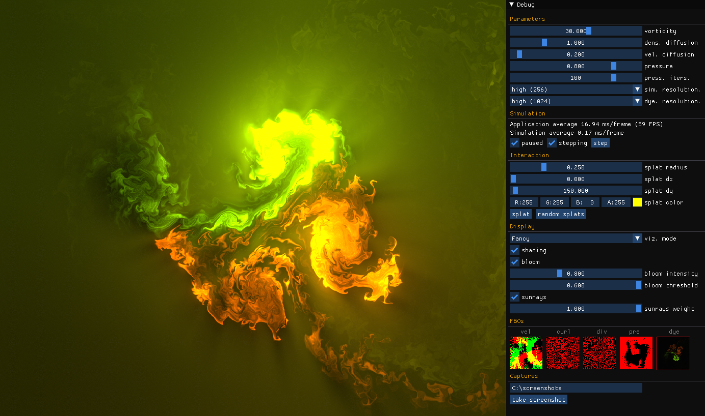

# Fluid Simulation
2D Fluid simulation in .NET + OpenGL (Silk.NET) inspired by PavelDoGreat [WebGL-Fluid-Simulation](https://github.com/PavelDoGreat/WebGL-Fluid-Simulation)

# Preview :eyes:

# Other references
  - [GPU Gems - Chapter 38. Fast Fluid Dynamics Simulation on the GPU](https://developer.nvidia.com/gpugems/gpugems/part-vi-beyond-triangles/chapter-38-fast-fluid-dynamics-simulation-gpu)
